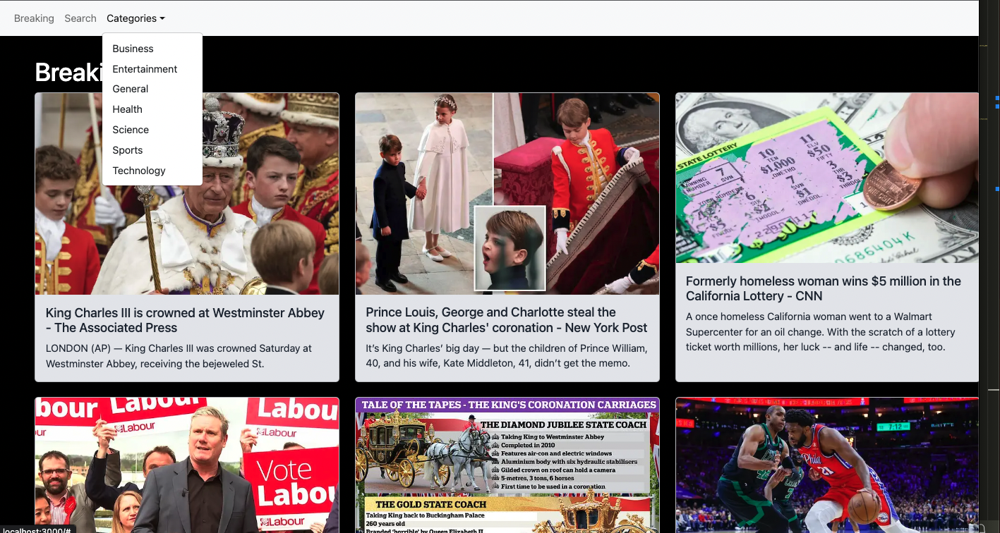

# News App

This is a basic news app developed using the Next.js framework and React-Bootstrap. It provides users with real-time trading news, a search feature, and a minimalistic layout for better readability.



## Features

- Real-time market updates and breaking news
- Search functionality to find specific articles
- Categorized news content for easy navigation
- Minimalist layout for distraction-free reading

## Technologies Used

- Next.js
- React-Bootstrap

## Getting Started

Follow the instructions below to get the project up and running on your local machine:

1. Clone the repository:

   ```shell
   git clone https://github.com/your-username/news-app.git
   


